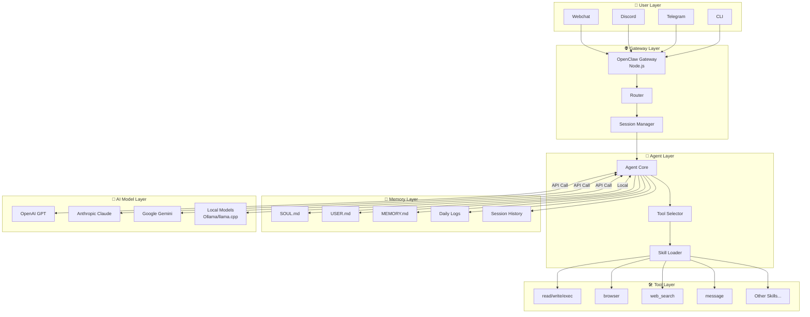
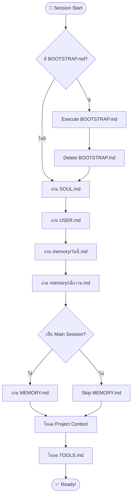
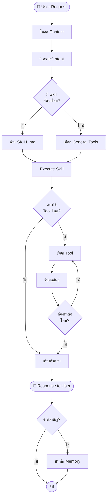
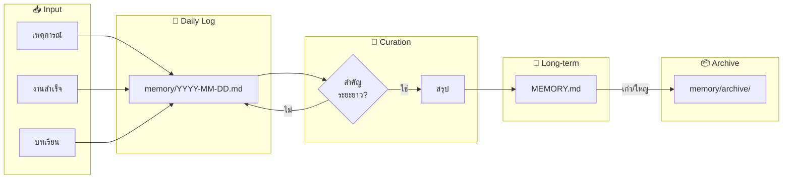
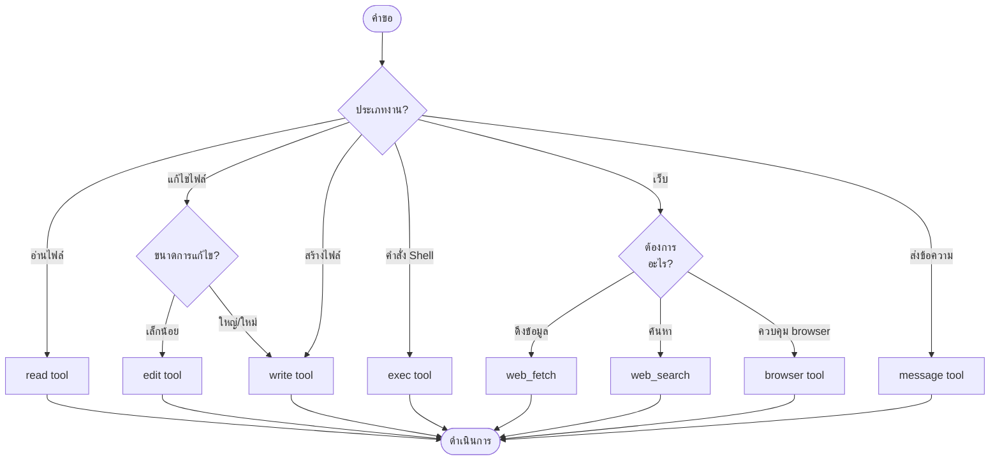
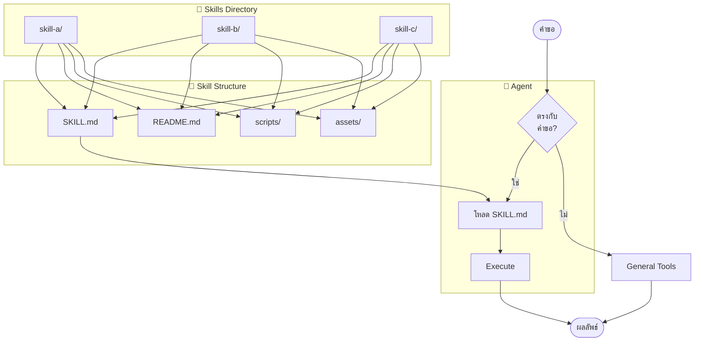
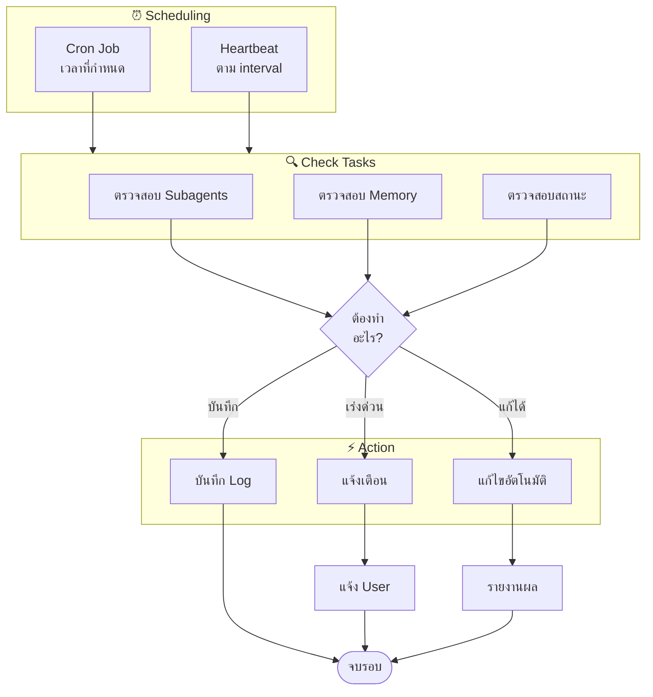
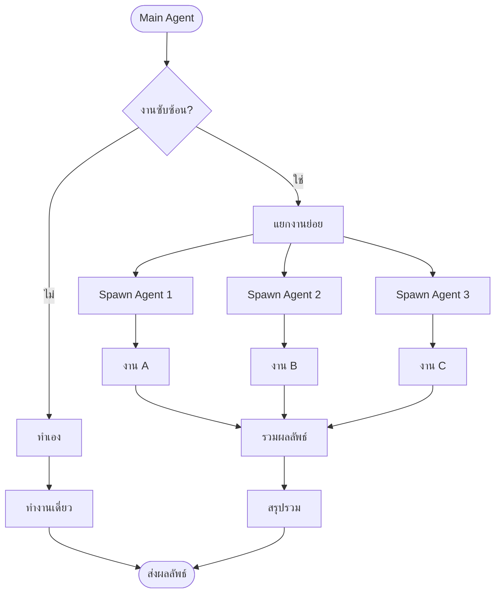
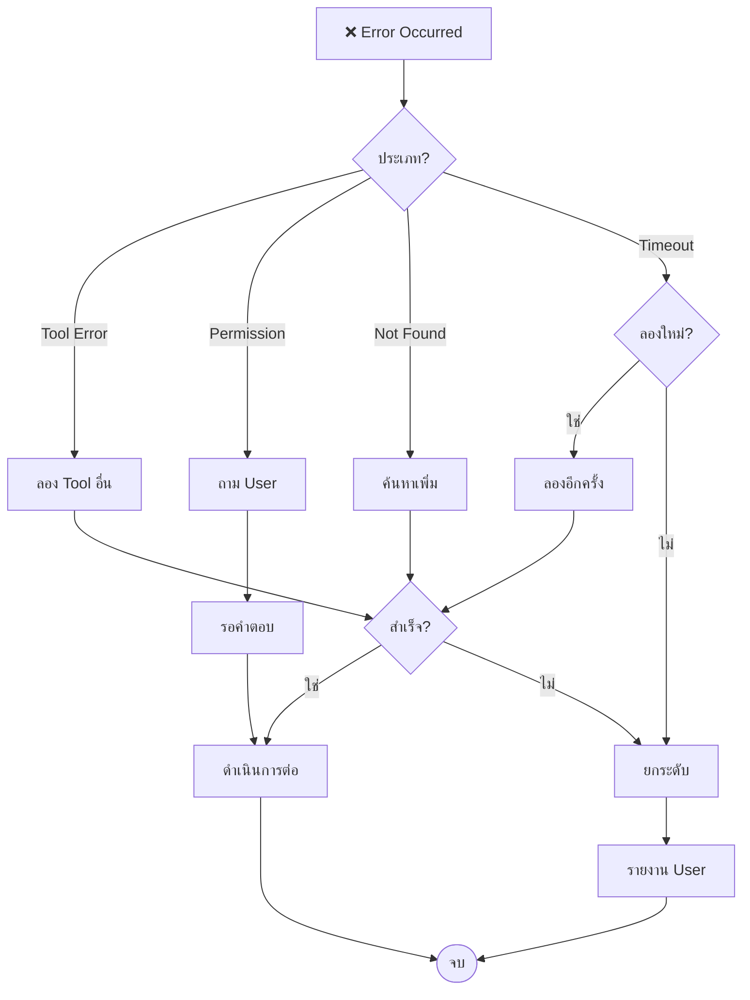

# OpenClaw Flow Diagrams

แผนภาพแสดงการทำงานของ OpenClaw (Mermaid Diagrams)

---

## 1. System Architecture Overview



---

## 2. Session Startup Flow



---

## 3. Request Processing Flow



---

## 4. Memory System Flow



---

## 5. Context Management Flow

```mermaid
flowchart TD
    Start([เริ่ม Session]) --> LoadFiles[โหลดไฟล์ Context]
    
    LoadFiles --> SizeCheck{ขนาด Context<br/>เกิน 20K?}
    
    SizeCheck -->|ใช่| Reduce[ลดขนาด]
    SizeCheck -->|ไม่| Process[ประมวลผล]
    
    Reduce --> ArchiveOld[ย้ายไฟล์เก่าไป Archive]
    ArchiveOld --> Summarize[สรุป MEMORY.md]
    Summarize --> Process
    
    Process --> Request[รับ Request]
    Request --> AddContext[เพิ่ม Context]
    
    AddContext --> CheckAgain{เต็มไหม?}
    CheckAgain -->|ใช่| SuggestNew[แนะนำ /new]
    CheckAgain -->|ไม่| Continue[ดำเนินการต่อ]
    
    SuggestNew --> NewSession[/new Session]
    Continue --> End([ดำเนินการ])
```

---

## 6. Tool Selection Decision Tree



---

## 7. Skill System Architecture



---

## 8. Cron & Heartbeat System



---

## 9. Sub-agent Orchestration



---

## 10. Error Handling Flow



---

*แผนภาพเหล่านี้สร้างด้วย Mermaid syntax*  
*GitHub รองรับการ render Mermaid diagrams โดยอัตโนมัติ*  
*สร้างเมื่อ: 2026-02-26 โดย เสี่ยวทู่ 🐰*
